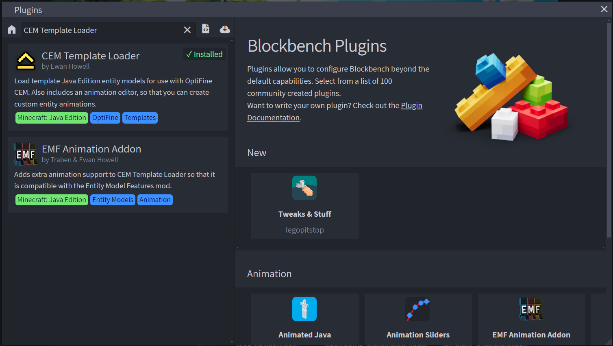
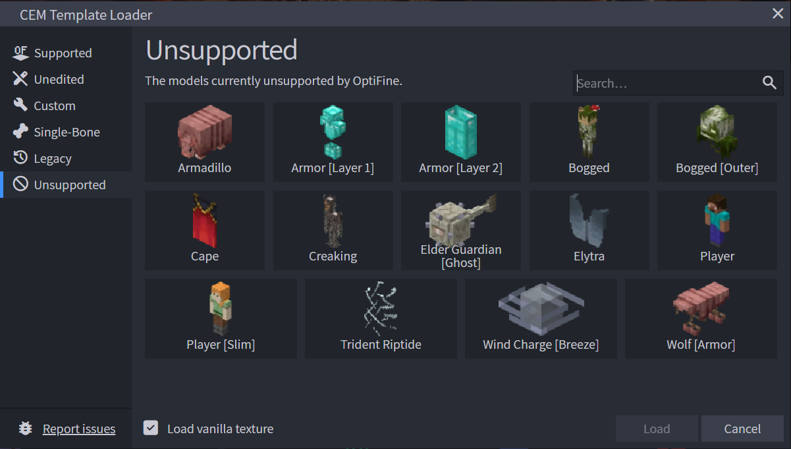
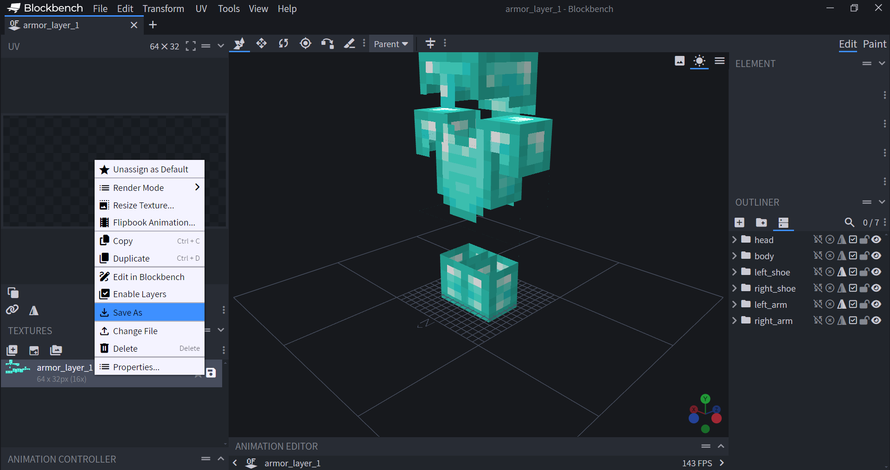

# Як створити власну текстуру для кастомних обладунків.

 1. Потрібно завантажити та відкрити Blockbench
 2. Відкриваємо Файл -> меню завантаження плагінів
 
 

 3. В ньому шукаємо CEM Template Loader та завантажуємо
 
 

 4. Далі на головній сторінці з'являється лоадер, відкриваємо його та натискаємо на Load CEM Template;
 
 

 5. У вкладці Unsupported обираємо Armor [Layer 1/Layer 2], де Layer 1 відповідає за шолом, нагрудник та чоботи, а Layer 2 відповідає лише за штани;
 
 

 6. Малюємо;
 7. Коли намалювали текстуру, натискаємо зліва ПКМ на файл з текстурою, далі натискаємо в меню на "Зберегти як"
 
 
 
 8. У будь-якому зручному редакторі малюємо іконку для предмета, використовуючи за основу іконки залізних обладунків. Бажано залишити темнені краї іконки, аби в інвентарі вона була добре помітною;

> По тому ж принципу можна намалювати кастомну текстуру для елітр.

# Як додати текстуру броні в ресурспак
 1. Переходимо в `assets/minecraft/optifine/cit`
 2. Дивимося як працюють вже існуючі предмети та повторюємо(неймовірно)